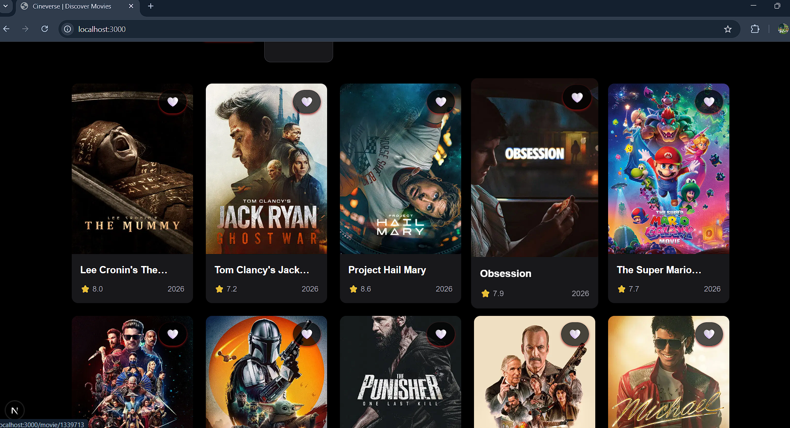
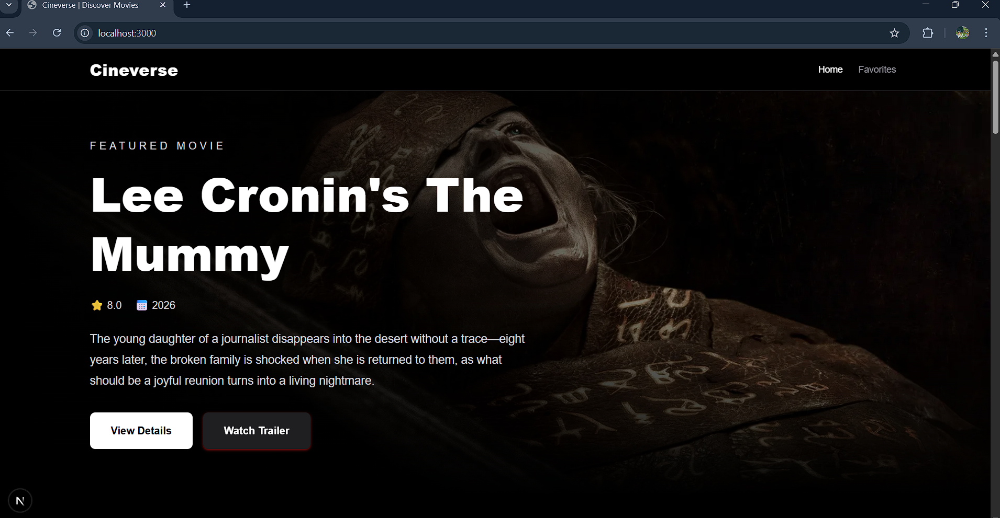
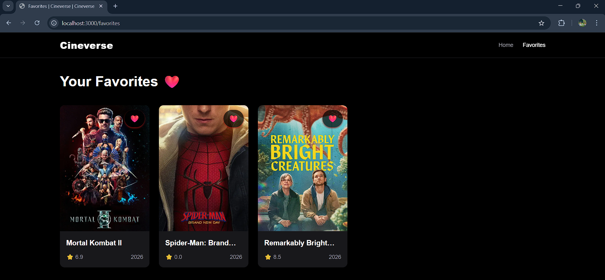

# 🎬 Cineverse

Cineverse is a modern movie discovery platform built using **Next.js 15 App Router**, **Server-Side Rendering (SSR)**, and **TMDB API**.  
The project was developed as an advanced migration and optimization upgrade from a traditional React SPA architecture into a fully SEO-optimized Next.js application.

---

# 🚀 Live Demo

🔗 Live Project Link:  
https://cineverse-next-level-693y.vercel.app/

---

# 📸 Screenshots





---

# ✨ Features

## 🔥 Core Features

- Trending Movies Fetching
- Dynamic Movie Details Pages
- Movie Search Functionality
- Genre Filtering
- Favorites System
- Infinite Scrolling
- Responsive UI Design
- Skeleton Loading States
- Toast Notifications

---

## 🎬 Advanced Movie Experience

- Trailer Modal Integration
- Cast Information Section
- Similar Movies Recommendations
- Reviews Section
- Actor Detail Pages
- Known For Movies Section

---

## ⚡ Next.js Features

- Next.js 15 App Router
- Server Components
- Client Components Isolation
- Dynamic Routing
- Server-Side Rendering (SSR)
- Dynamic Metadata Injection
- SEO Optimization

---

## 🌍 Advanced SEO Features

- Dynamic OpenGraph Metadata
- Twitter Cards
- Sitemap Generation
- Robots.txt Configuration
- Canonical SEO Structure

---

# 🛠️ Tech Stack

## Frontend
- Next.js 15
- React 19
- Tailwind CSS

## APIs
- TMDB API

## Deployment
- Vercel

---

# 📂 Project Structure

```bash
app/
├── api/
├── favorites/
├── movie/[id]/
├── person/[id]/
├── layout.js
├── page.js

features/
├── favorites/
├── movies/
│   ├── components/
│   ├── hooks/
│   ├── services/

shared/
├── components/
"# Cineverse-nextLevel" 
